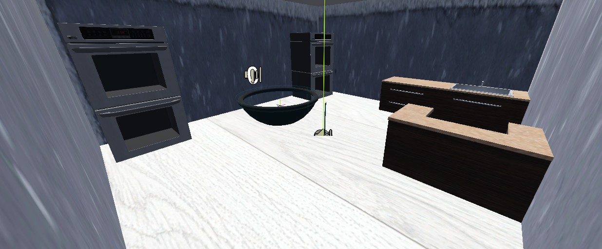
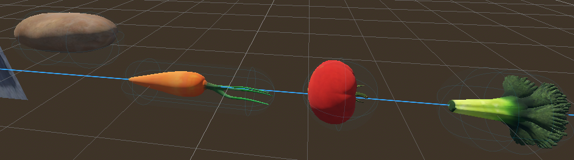
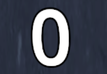
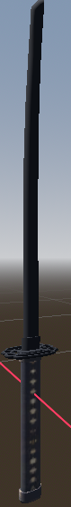

# XR Vege Slicer

---

### Name  
Cormac Holohan  

### Student Number  
C22363913  

### Class Group  
Tu/856

### GitHub  
[https://github.com/CoHolohan/xrp25](https://github.com/CoHolohan)

---

## Video

### YouTube  
https://www.youtube.com/shorts/ZTpYOhfEOq4

---

## Screenshots
The Area

The Different falling vegetables

Score Label

Katanas

---

## Description of the Project

This project is a game inspired by the classic *Fruit Ninja*.  
Vegetables spawn above a bowl and fall through the air while the player uses XR hand controllers as katanas to slice them mid-air.

When vegetables are sliced, they disappear with particle effects and sound feedback, and the player’s score increases.  
If vegetables are missed, they fall to the floor where a miss sound is played.

The project uses physics-based motion, spatial audio, and XR interaction to create an engaging and intuitive experience.

This projectaligns with **UN Sustainable Development Goal #2 – Zero Hunger**, encouraging interaction with food items in a playful way.

---

## Instructions for Use

1. Ensure **OpenXR** and **Godot XR Tools** are enabled.
2. Connect an XR headset (Meta Quest recommended).
3. Run the main scene.
4. Use XR controllers:
   - Your hands act as swords
   - Slice falling vegetables before they hit the floor
5. Watch the score counter beside the bowl increase with each successful slice.
6. Background music and spatial sound effects play automatically.

---

## How It Works

- Vegetables are spawned at timed intervals above a bowl using a spawner system.
- Each vegetable is a RigidBody3D affected by gravity, drift, and rotation.
- The player’s hands are represented as Area3D sword objects.
- When a sword intersects a vegetable:
  - The vegetable is sliced
  - Particle effects and sounds play
  - The score increases
- A floor kill zone detects missed vegetables and plays a miss sound.
- A Label3D displays the score beside the bowl.
- Background music plays continuously during gameplay.

---

## List of Classes / Assets in the Project

| Class / Asset | Source |
|--------------|--------|
| Vegetable.gd | Self written / Ai assistance |
| VegetableSpawner.gd | Self written / Ai assistance|
| Blade.gd | Self written |
| FloorKillZone.gd | Self written |
| Bowl.gd | Self written |
| ScoreDisplay.gd | Self written |
| VegCutEffect.tscn | Self written |
| Vegetable 3D models | Blender / Modified assets |
| Slice and miss sound effects | FreeSound (open license) |
| Background music | FreeSound (open license) |
| Godot XR Tools | External library |
| OpenXR Plugin | External plugin |

---

## References

1. Godot Engine Documentation – https://docs.godotengine.org  
2. Godot XR Tools – https://github.com/GodotVR/godot-xr-tools  
3. OpenXR Specification – https://www.khronos.org/openxr  
4. FreeSound – https://freesound.org  
5. Free3D – https://free3d.com/ 

---

## What I Am Most Proud Of in the Assignment

I am most proud of successfully implementing a complete XR gameplay loop that combines slicing mechanics, physics-based motion, particle effects, spatial audio, and score tracking.  
Seeing all systems working together inside an XR headset was especially rewarding.

---

## What I Learned

Through this project, I learned how to:

- Develop XR applications using Godot 4 and OpenXR
- Implement physics-based gameplay in 3D environments
- Use Area3D and RigidBody3D appropriately
- Use signals for clean and modular game logic
- Implement spatial audio for XR experiences
- Debug and test XR interactions effectively

---

## Proposal Submitted Earlier

# Initial Proposal
## Project Overview
is an immersive Extended Reality (XR) experience inspired by the classic *Fruit Ninja* game.  
In this interactive simulation, various food items fall from the sky, and the player uses hand-tracking or motion controllers to slice them in midair. The sliced pieces then fall naturally into a pot, earning the player points

The UN Sustainability development Goal this relates to would be no.2 Zero Hunger

The goal of the project is to create a fun and intuitive XR environment that leverages spatial interaction and physics-based gameplay, offering users an engaging, physically interactive experience.

---

## Core Features
- **XR-based slicing interaction** using hand gestures
- **Physics-based food slicing** and realistic motion of food fragments  
- **Dynamic scoring system** based on accuracy and combo slicing  
- **Immersive sound and haptic feedback** for each successful cut  
- **3D pot collection mechanic** where sliced remains fall into a container  
- **Stylized 3D environment** with interactive spatial audio and effects  

## XR Frameworks & Plugins
- **Godot XR Tools** – Provides interaction nodes, XR origin setups, and hand/controller tracking.
- **OpenXR Plugin** – Enables cross-platform XR support (VR headsets and AR devices).
- **Godot XR Hands / Controllers** – Used for hand tracking, controller input, and slicing gesture detection.

---

## Interaction Libraries
- **XR Interaction Toolkit (Godot XR Tools)** – For implementing direct and ray-based interactions.
- **Godot XR Input Mapper** – To handle gesture detection (slice, grab, throw).
- **Godot Physics Engine** – For simulating falling objects and fragment collisions.
- **Godot Visual Scripting / Input Actions** – To map user slicing motions to game actions.

---

## Assets & Design Tools
- **Blender** – For modeling fruits, pots, and environment assets.
- **Audacity** – For sound design and slicing effects.
- **FreeSound / Poly Haven** – Sources for open-licensed textures and audio clips.

